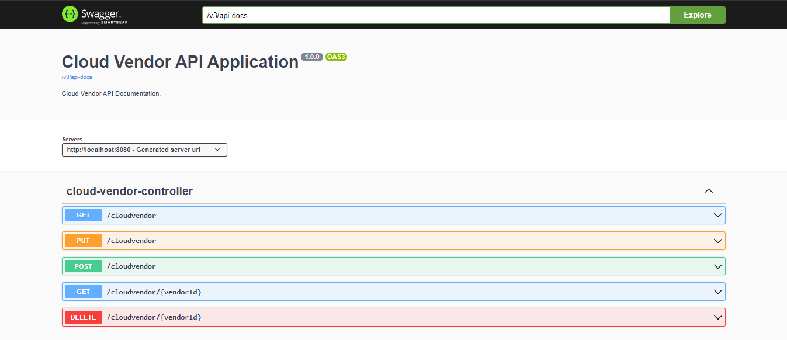

# Cloud Vendor Info Rest API

A Rest API project developed using springboot. Cloud Vendor Info REST API is a project aimed at providing a RESTful interface for accessing information about various cloud vendors.

## SpringDoc OpenAPI Documentation

